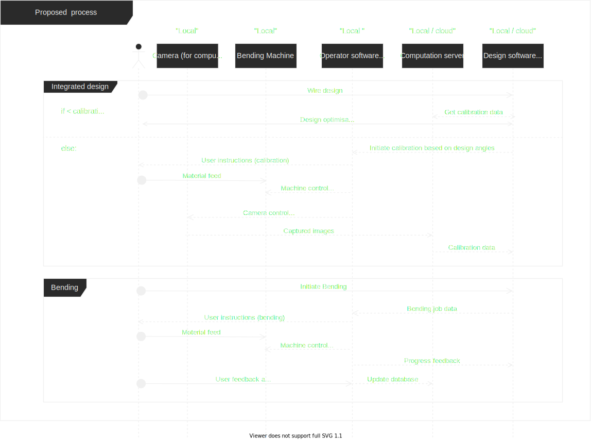

# Abo Hmaid collaboration repo

## Wire Bending project:

### Problems:

- default software has bugs and not intergated in any common design software(Rhino3d: https://www.rhino3d.com/).
- machine calibration is not accurate "human error".
- not modular "one application for design, computation and machine control".
- Java :) ; dose not have enough computational libraries.
- calibration data is stored localy, user dosn't have access to calibration data from other users.

### Proposal:

- replace human measurments with computer vision process.
- store calibration data remotely; to be accessible for other users.
- do server side computation for computationally expensive processies " computer vision ".
- use submodules would enhance collaboration between designers and fabricators, plus easier software mentenance.

### Questions:

- cloud deployment ?
- IPC websockets ??

Thanks Abohmaid :)
